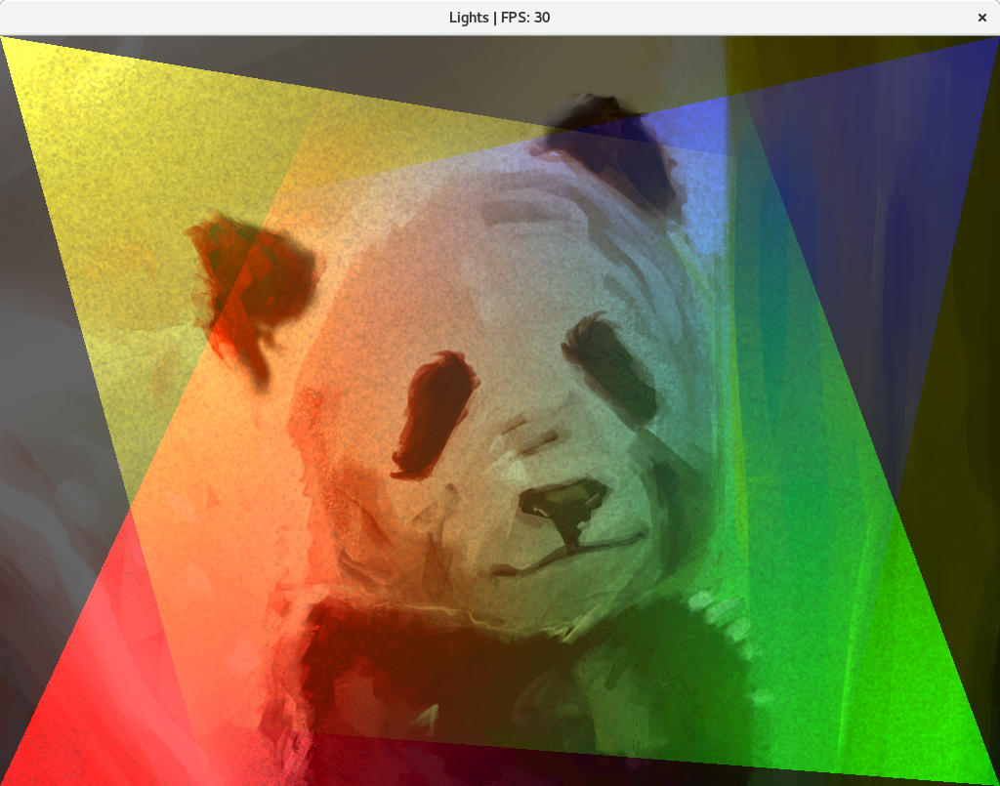
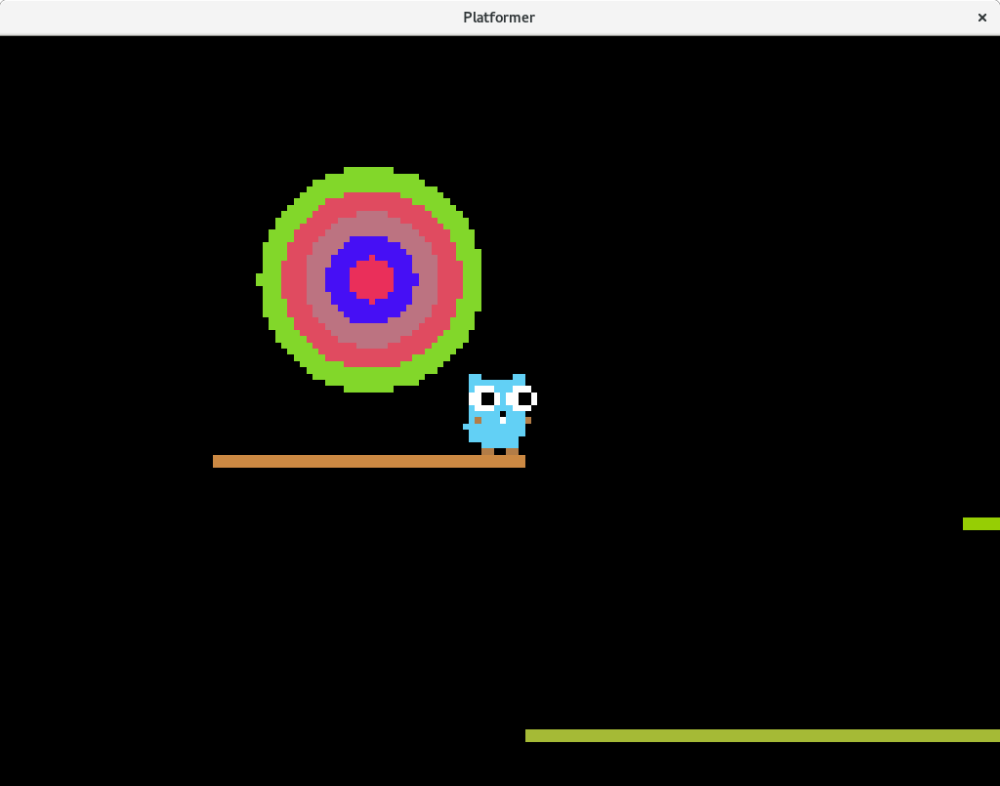
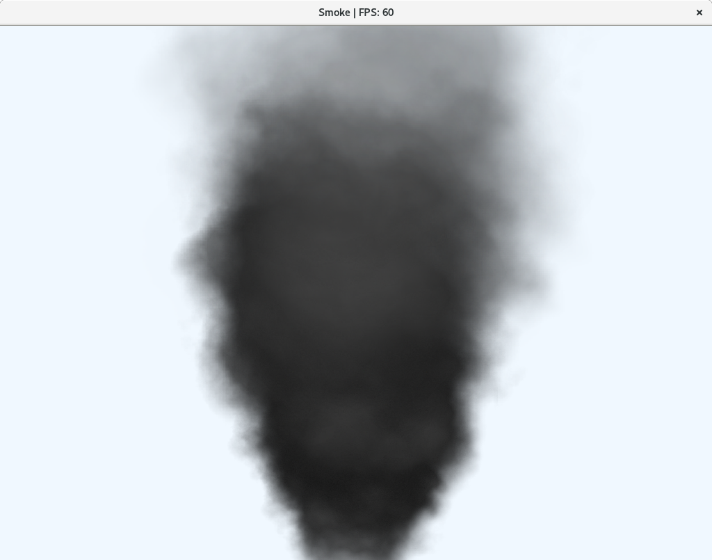
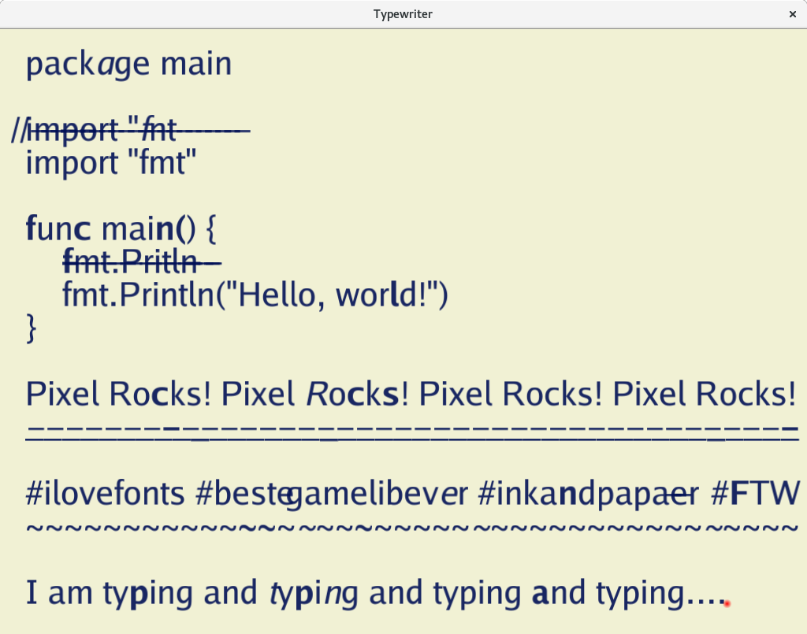

# Pixel [](https://godoc.org/github.com/faiface/pixel) [](https://goreportcard.com/report/github.com/faiface/pixel) [](https://gitter.im/pixellib/Lobby?utm_source=badge&utm_medium=badge&utm_campaign=pr-badge&utm_content=badge)

A hand-crafted 2D game library in Go. Take a look into the [features](#features) to see what it can
do.

```
go get github.com/faiface/pixel
```

See [requirements](#requirements) for the list of libraries necessary for compilation.

## Tutorial

The [Wiki of this repo](https://github.com/faiface/pixel/wiki) contains an extensive tutorial
covering several topics of Pixel. Here's the content of the tutorial parts so far:

- [Creating a Window](https://github.com/faiface/pixel/wiki/Creating-a-Window)
- [Drawing a Sprite](https://github.com/faiface/pixel/wiki/Drawing-a-Sprite)
- [Moving, scaling and rotating with Matrix](https://github.com/faiface/pixel/wiki/Moving,-scaling-and-rotating-with-Matrix)
- [Pressing keys and clicking mouse](https://github.com/faiface/pixel/wiki/Pressing-keys-and-clicking-mouse)
- [Drawing efficiently with Batch](https://github.com/faiface/pixel/wiki/Drawing-efficiently-with-Batch)
- [Drawing shapes with IMDraw](https://github.com/faiface/pixel/wiki/Drawing-shapes-with-IMDraw)
- [Typing text on the screen](https://github.com/faiface/pixel/wiki/Typing-text-on-the-screen)

## Examples

The [examples](https://github.com/faiface/pixel/tree/master/examples) directory contains a few
examples demonstrating Pixel's functionality.

**To run an example**, navigate to it's directory, then `go run` the `main.go` file. For example:

```
$ cd examples/platformer
$ go run main.go
```

Here are some screenshots from the examples!

| [Lights](examples/lights) | [Platformer](examples/platformer) |
| --- | --- |
|  |  |

| [Smoke](examples/smoke) | [Typewriter](examples/typewriter) |
| --- | --- |
|  |  |

## Features

Here's the list of the main features in Pixel. Although Pixel is still under heavy development,
**there should be no major breakage in the API.** This is not a 100% guarantee, though.

- Fast 2D graphics
  - Sprites
  - Primitive shapes with immediate mode style
    [IMDraw](https://github.com/faiface/pixel/wiki/Drawing-shapes-with-IMDraw) (circles, rectangles,
    lines, ...)
  - Optimized drawing with [Batch](https://github.com/faiface/pixel/wiki/Drawing-efficiently-with-Batch)
  - Text drawing with [text](https://godoc.org/github.com/faiface/pixel/text) package
- Simple and convenient API
  - Drawing a sprite to a window is as simple as `sprite.Draw(window, matrix)`
  - Wanna know where the center of a window is? `window.Bounds().Center()`
  - [...](https://godoc.org/github.com/faiface/pixel)
- Full documentation and tutorial
- Works on Linux, macOS and Windows
- Window creation and manipulation (resizing, fullscreen, multiple windows, ...)
- Keyboard (key presses, text input) and mouse input without events
- Well integrated with the Go standard library
  - Use `"image"` package for loading pictures
  - Use `"time"` package for measuring delta time and FPS
  - Use `"image/color"` for colors, or use Pixel's own `color.Color` format, which supports easy
    multiplication and a few more features
  - Pixel uses `float64` throughout the library, compatible with `"math"` package
- Geometry transformations with
  [Matrix](https://github.com/faiface/pixel/wiki/Moving,-scaling-and-rotating-with-Matrix)
  - Moving, scaling, rotating
  - Easy camera implementation
- Off-screen drawing to Canvas or any other target (Batch, IMDraw, ...)
- Fully garbage collected, no `Close` or `Dispose` methods
- Full [Porter-Duff](http://ssp.impulsetrain.com/porterduff.html) composition, which enables
  - 2D lighting
  - Cutting holes into objects
  - Much more...
- Pixel let's you draw stuff and do your job, it doesn't impose any particular style or paradigm
- Platform and backend independent [core](https://godoc.org/github.com/faiface/pixel)
- Core Target/Triangles/Picture pattern makes it easy to create new drawing targets that do
  arbitrarily crazy stuff (e.g. graphical effects)
- Small codebase, ~5K lines of code, including the backend [glhf](https://github.com/faiface/glhf)
  package

## Missing features

Pixel is in development and still missing few critical features. Here're the most critical ones.

- Audio
- ~~Drawing text~~
- Antialiasing (filtering is supported, though)
- ~~Advanced window manipulation (cursor hiding, window icon, ...)~~
- Better support for Hi-DPI displays
- Mobile (and perhaps HTML5?) backend
- More advanced graphical effects (e.g. blur)
- Tests and benchmarks

**Implementing these features will get us to the 1.0 release.** Contribute, so that it's as soon as
possible!

## Requirements

[PixelGL](https://godoc.org/github.com/faiface/pixel/pixelgl) backend uses OpenGL to render
graphics. Because of that, OpenGL development libraries are needed for compilation. The dependencies
are same as for [GLFW](https://github.com/go-gl/glfw).

- On macOS, you need Xcode or Command Line Tools for Xcode (`xcode-select --install`) for required
  headers and libraries.
- On Ubuntu/Debian-like Linux distributions, you need `libgl1-mesa-dev` and `xorg-dev` packages.
- On CentOS/Fedora-like Linux distributions, you need `libX11-devel libXcursor-devel libXrandr-devel
  libXinerama-devel mesa-libGL-devel libXi-devel` packages.
- See [here](http://www.glfw.org/docs/latest/compile.html#compile_deps) for full details.

**The combination of Go 1.8, macOS and latest XCode seems to be problematic** as mentioned in issue
[#7](https://github.com/faiface/pixel/issues/7). This issue is probably not related to Pixel.
**Upgrading to Go 1.8.1 fixes the issue.**

## Contributing

Pixel is in, let's say, mid-stage of development. Many of the important features are here, some are
missing. That's why **contributions are very important and welcome!** All alone, I will be able to
finish the library, but it'll take a lot of time. With your help, it'll take much less. I encourage
everyone to contribute, even with just an idea. Especially welcome are **issues** and **pull
requests**.

**However, I won't accept everything. Pixel is being developed with thought and care.** Each
component was designed and re-designed multiple times. Code and API quality is very important here.
API is focused on simplicity and expressiveness.

When contributing, keep these goals in mind. It doesn't mean that I'll only accept perfect pull
requests. It just means that I might not like your idea. Or that your pull requests could need some
rewriting. That's perfectly fine, don't let it put you off. In the end, we'll just end up with a
better result.

**Don't start working on a pull request before submiting an issue or commenting on one. Proposals
also take the form of issues.**

For any kind of discussion, feel free to use our
[Gitter](https://gitter.im/pixellib/Lobby?utm_source=badge&utm_medium=badge&utm_campaign=pr-badge&utm_content=badge)
community.

## License

[MIT](LICENSE)
