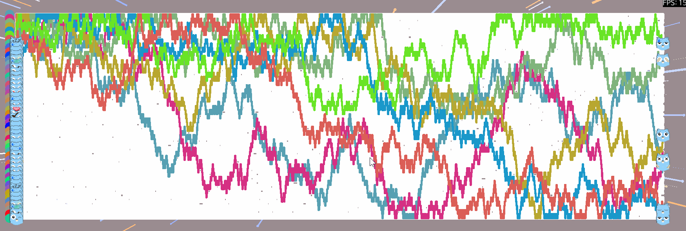

# [AMIDA KUJI](https://github.com/NaniteFactory/amidakuji/tree/1bf57c3639e4e5628d96d9171ed9e679b658fadb)

> Ghost Leg (Chinese: 畫鬼腳), known in Japan as Amidakuji (阿弥陀籤, "Amida lottery", so named because the paper was folded into a fan shape resembling Amida's halo) or in Korea as Sadaritagi (사다리타기, literally "ladder climbing"), is a method of lottery designed to create random pairings between two sets of any number of things, as long as the number of elements in each set is the same. This is often used to distribute things among people, where the number of things distributed is the same as the number of people. For instance, chores or prizes could be assigned fairly and randomly this way.

(Explanation from [Wikipedia](https://en.wikipedia.org/wiki/Ghost_Leg))

- - -

## Examples

| [GIF1](examples/user_conf_sample6.json) | [GIF2](examples/user_conf_sample3.json) |
| --- | --- |
|  |  |

| GIF3 |
| --- |
|  |

- - -

## Control

|  | Action | Input |
| --- | --- | --- |
|🔀 | Shuffle | 1 |
| ▶️ | Find path | 2 |
| ⏩ | Find path (faster) | 3 |
| ⏸ | Pause | Space |
| ⬆️➡️⬇️⬅️ | Move camera around | Arrow keys |
| ↩️ | Rotate camera | Enter |
| 🔭 | Zoom in and out | Scroll |
| 🎇 | Firework | Left click |
| 🔬 | Inspection | Right click |
| 🔁 | Toggle full screen mode | Tab |

- - -

## Build

#### Windows

```
$ go get -v github.com/faiface/pixel/examples/community/amidakuji/...
$ go get -v -u github.com/go-bindata/go-bindata/...
```

```
$ cd $GOPATH/src/github.com/faiface/pixel/examples/community/amidakuji/
$ make
```

#### Ubuntu

```
$ sudo apt-get clean
$ sudo rm -r /var/lib/apt/lists/*
$ sudo apt update
```

```
$ sudo apt install libglib2.0-dev libpango1.0-dev libasound2-dev libgdk-pixbuf2.0-dev libgl1-mesa-dev xorg-dev libgtk2.0-dev
```

```
$ go get -v github.com/faiface/pixel/examples/community/amidakuji/...
$ go get -v -u github.com/go-bindata/go-bindata/...
```

```
$ cd $GOPATH/src/github.com/faiface/pixel/examples/community/amidakuji/
$ make
```

- - -

## External sources

#### Library
- [Pixel](https://github.com/faiface/pixel/tree/7cff3ce3aed80129b7b1dd57e63439426e11b6ee)
- [Beep](https://github.com/faiface/beep/tree/63cc6fbbac46dba1a03e55f0ebc965d6c82ca8e1)
- [GLFW 3.2](https://github.com/go-gl/glfw/tree/513e4f2bf85c31fba0fc4907abd7895242ccbe50/v3.2/glfw)
- [dialog](https://github.com/sqweek/dialog/tree/2f9d9e5dd848a3bad4bdd0210c73bb90c13a3791)

#### Music
- [Night Tempo - Pure Present](https://nighttempo.bandcamp.com/album/pure-present) - [08 Kikuchi Momoko - Night Cruising (Night Tempo 100% Pure Remastered)](https://nighttempo.bandcamp.com/track/kikuchi-momoko-night-cruising-night-tempo-100-pure-remastered-2)
- [Night Tempo - Pure Present](https://nighttempo.bandcamp.com/album/pure-present) - [19 Takeuchi Mariya - Plastic Love (Night Tempo 100% Pure Remastered)](https://nighttempo.bandcamp.com/track/takeuchi-mariya-plastic-love-night-tempo-100-pure-remastered-3)

#### Image
- [Gophers...](https://github.com/egonelbre/gophers/tree/dfb1bc3e6092179bd80d2e4156a8d32dba484cc9)

#### Font
- [나눔바른고딕 (NanumBarunGothic.ttf)](https://hangeul.naver.com/2017/nanum)

