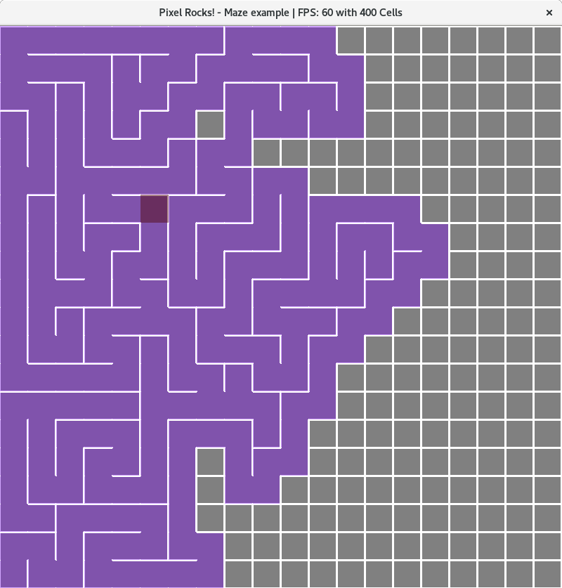

# Maze generator in Go

Created by [Stephen Chavez](https://github.com/redragonx)

This uses the game engine: Pixel. Install it here: https://github.com/faiface/pixel

I made this to improve my understanding of Go and some game concepts with some basic maze generating algorithms.

Controls: Press 'R' to restart the maze.

Optional command-line arguments: `go run ./maze-generator.go`
  - `-w` sets the maze's width in pixels.
  -	`-h` sets the maze's height in pixels.
  -	`-c` sets the maze cell's size in pixels.

Code based on the Recursive backtracker algorithm. 
- https://en.wikipedia.org/wiki/Maze_generation_algorithm#Recursive_backtracker

