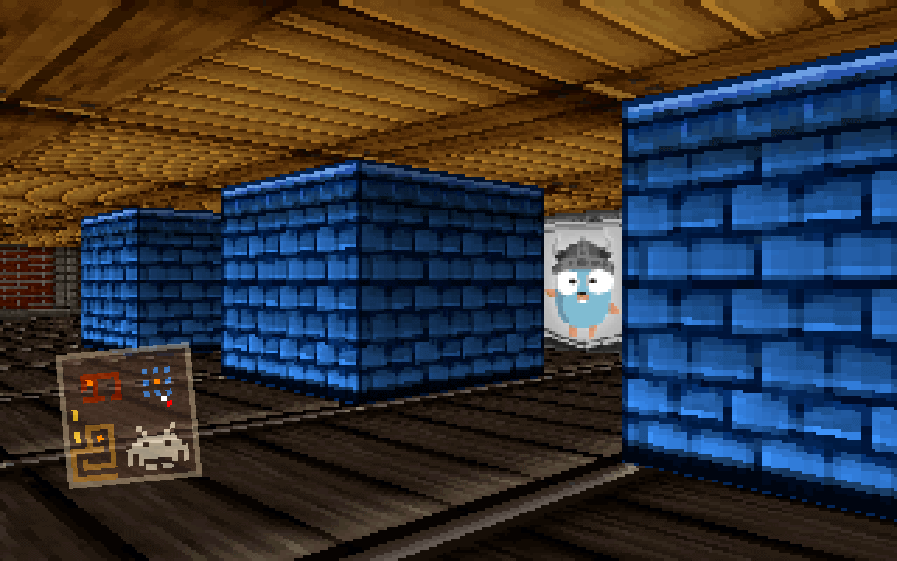

# raycaster

A raycaster made by [Peter Hellberg](https://github.com/peterhellberg/) as part of his [pixel-experiments](https://github.com/peterhellberg/pixel-experiments).

Based on Lode’s article on [raycasting](http://lodev.org/cgtutor/raycasting.html).

## Controls

WASD for strafing and arrow keys for rotation.

Place blocks using the number keys.

## Screenshots

## Links

 - https://github.com/peterhellberg/pixel-experiments/tree/master/raycaster
 - https://gist.github.com/peterhellberg/835eccabf95800555120cc8f0c9e16c2
