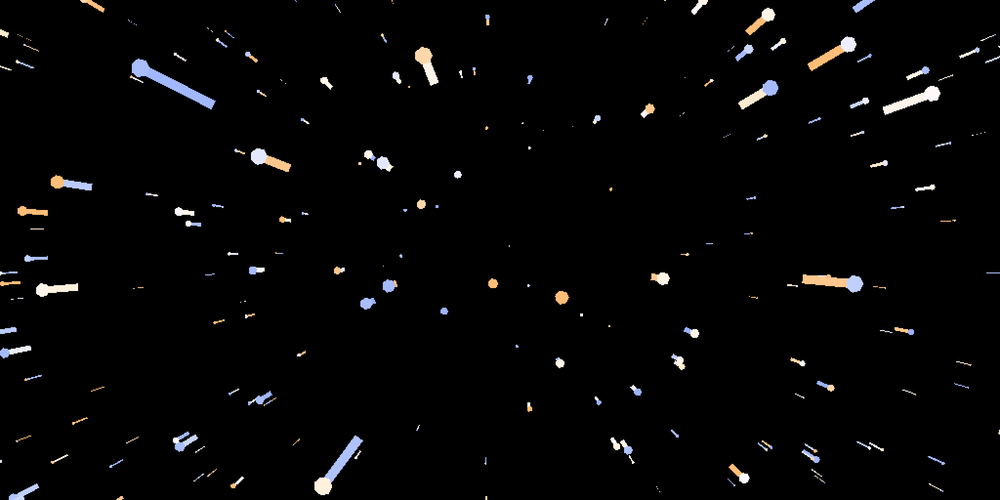

# starfield

Classic starfield… with [supposedly accurate stellar colors](http://www.vendian.org/mncharity/dir3/starcolor/)

Made by [Peter Hellberg](https://github.com/peterhellberg/) as part of his [pixel-experiments](https://github.com/peterhellberg/pixel-experiments)

## Controls

Arrow up and down to change speed. Space bar to almost stop.

## Screenshots

## Links

 - https://github.com/peterhellberg/pixel-experiments/tree/master/starfield
 - https://gist.github.com/peterhellberg/4018e228cced61a0bb26991e49299c96
