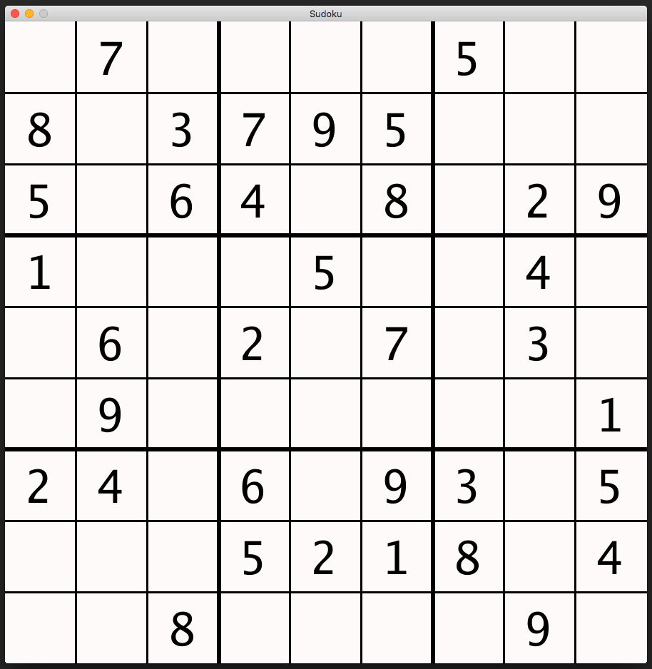

# Sudoku

A game of Sudoku written in [Go][go].

From [Wikipedia][sudoku-wiki]:
> Sudoku (数独 sūdoku, digit-single) (/suːˈdoʊkuː/, /-ˈdɒk-/, /sə-/, originally
> called Number Place) is a logic-based, combinatorial number-placement puzzle.
> The objective is to fill a 9×9 grid with digits so that each column, each row,
> and each of the nine 3×3 subgrids that compose the grid (also called "boxes",
> "blocks", or "regions") contains all of the digits from 1 to 9. The puzzle
> setter provides a partially completed grid, which for a well-posed puzzle has
> a single solution.

Created by [Jason Wangsadinata][jwangsadinata] using
[Pixel][pixel].

This example is kept to the bare minimum for demonstrating just the main
concepts of using imdraw, and batch with texts. For a game with slightly more
features, please check out [Go-Sudoku][go-sudoku]

## Usage

Run it the usual way:

    go run sudoku.go

## How to Play

- *Left mouse* click to select a box.
- *Number keys* to input a number.
- *Space* or *Backspace* to delete a number.

## Screenshots

## Links

- [Go-Sudoku][go-sudoku]

[go]: https://golang.org
[go-sudoku]: https://github.com/jwangsadinata/go-sudoku
[jwangsadinata]: https://github.com/jwangsadinata
[pixel]: https://github.com/faiface/pixel
[sudoku-wiki]: https://en.wikipedia.org/wiki/Sudoku
