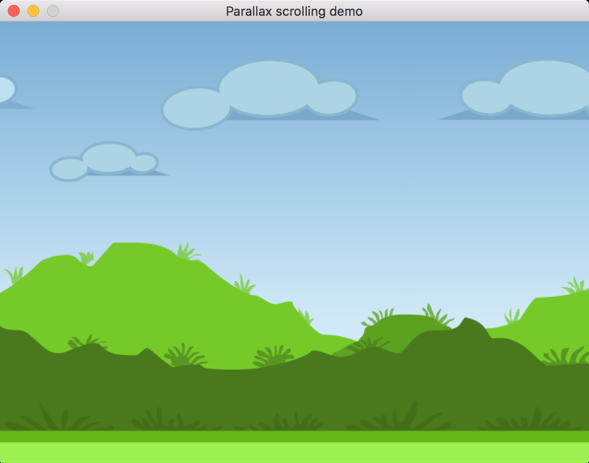

# Parallax scrolling demo

Created by [Sergio Vera](https://github.com/svera)

This example shows how to implement an infinite side scrolling background with a depth effect, using [parallax scrolling](https://en.wikipedia.org/wiki/Parallax_scrolling). Code is based in the [infinite scrolling background](https://github.com/faiface/pixel/tree/master/examples/community/scrolling-background) demo.

Credits to [Peter Hellberg](https://github.com/peterhellberg) for the improved background images.

